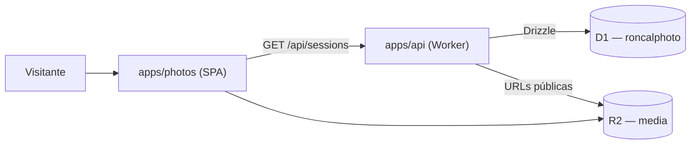

# 01 — Visión general de la arquitectura

RoncalPhoto es un **monorepo** (Turborepo + Bun workspaces) que aloja un
portafolio fotográfico profesional desplegado íntegramente sobre Cloudflare.

Este documento describe el mapa de alto nivel: piezas, responsabilidades y los
principios transversales que se repiten en todo el repositorio. Es la base
conceptual para los documentos 02 (backend), 03 (infraestructura) y 04 (reglas
para productos nuevos).

## Mapa del monorepo

```text
roncalphoto/
├── apps/
│   ├── api/            # Hono REST API en Cloudflare Workers + D1 (Drizzle)
│   ├── photos/         # Galería pública — Vite + React 19 (SPA en Worker)
│   └── photos-admin/   # Dashboard admin — Vite + React 19 (auth-protected)
├── packages/
│   ├── auth/           # @roncal/auth — factory de Better Auth (Email OTP)
│   ├── shared/         # @roncal/shared — tipos de dominio y mappers (sin build)
│   ├── ui/             # @roncal/ui — primitivos React compartidos
│   └── api-client/     # cliente tipado de la API
└── docs/               # documentación operativa y de arquitectura
```

Servicios **externos al monorepo**, consumidos por _service binding_:

- `ming-email-worker` — emails transaccionales (entrega de OTP). Repositorio standalone.
- `ming-image-worker` — procesamiento de imágenes (resize, miniaturas, R2). Repositorio standalone.

Ambos son **workers comunes multi-producto**: no pertenecen a RoncalPhoto, RoncalPhoto es solo uno de sus consumidores. Ver [documento 03](./03-infraestructura-cloudflare.md).

## Responsabilidades por pieza

| Pieza                  | Tipo                       | Responsabilidad                                                                 |
| ---------------------- | -------------------------- | ------------------------------------------------------------------------------- |
| `apps/api`             | Worker (Hono)              | Única fuente de verdad de negocio. Expone `/api/*`, habla con D1, R2 y workers. |
| `apps/photos`          | Worker (static assets SPA) | Frontend público de lectura. Consume la API.                                    |
| `apps/photos-admin`    | Worker (static assets SPA) | Backoffice autenticado (Better Auth). Sube fotos, gestiona sesiones.            |
| `packages/shared`      | Paquete TS (sin build)     | Tipos de dominio canónicos y mappers. Importado directo desde fuente.           |
| `packages/auth`        | Paquete TS                 | Factory de Better Auth + cliente. Reusable entre productos.                     |
| `ming-email-worker`    | Worker común (externo)     | Envío transaccional interno. Nunca expuesto al navegador.                       |
| `ming-image-worker`    | Worker común (externo)     | Pipeline de subida/optimización de imágenes. Nunca expuesto al navegador.       |

## Flujo de datos (lectura pública)



El frontend público nunca habla con D1 ni con workers internos: solo con la API.
La API normaliza filas de D1 (que pueden tener `null`) hacia los tipos no
nullables de `@roncal/shared`.

## Flujo de escritura (admin + media)

```mermaid
flowchart LR
    Adm["apps/photos-admin"] -->|POST /api/photo-uploads| A["apps/api"]
    A -->|service binding| IW["ming-image-worker"]
    IW -->|URL PUT firmada| Adm
    Adm -->|PUT original| R2o[("R2 originals")]
    R2o -->|object-create → Queue| IW
    IW -->|main + thumbnail| R2m[("R2 media")]
    Adm -->|GET /api/photo-uploads/:id (poll)| A
```

Este patrón —**reserva de ID, subida directa a R2 con URL firmada,
procesamiento asíncrono por cola, _polling_ de estado**— es el patrón de
referencia para cualquier media pesada del ecosistema (incluidas las notas de
voz del producto nuevo). Se detalla en los documentos 02 y 04.

## Principios transversales

Estos principios se cumplen hoy en RoncalPhoto y son obligatorios para productos nuevos:

1. **Todo corre en Cloudflare Workers.** Sin servidores tradicionales ni contenedores.
2. **La API es la única autoridad de negocio.** Frontends y clientes móviles solo consumen la API.
3. **Los workers comunes son servicios internos.** Se invocan por _service binding_, nunca se exponen a Internet ni al navegador/cliente. La capa pública y antiabuso vive en la API del producto.
4. **Arquitectura por capas estricta** en el backend: `routes → services → repositories → db`, validada por ESLint (ver [02](./02-arquitectura-backend.md)).
5. **Módulos aislados.** Los módulos de negocio no se importan entre sí; lo compartido vive en `src/shared/`.
6. **Tipos de dominio no nullables** en `@roncal/shared`; la API normaliza los `null` de D1.
7. **Migraciones expand/contract.** Cambios de esquema compatibles hacia atrás antes de retirar formas viejas.
8. **Separación credenciales de despliegue vs. variables de runtime** (ver [`cloudflare-production.md`](../cloudflare-production.md)).
9. **Bun como único gestor de paquetes.** Nada de npm/yarn/pnpm.
10. **`strict: true` en TypeScript**, sin `any`, con Zod para validación de límites.

## Stack resumido

- **Monorepo**: Turborepo + Bun workspaces.
- **Backend**: Hono sobre Cloudflare Workers, `@hono/zod-openapi` para contratos.
- **Base de datos**: D1 (SQLite) con Drizzle ORM, driver `d1-http` para migraciones.
- **Almacenamiento**: R2 para binarios (imágenes).
- **Auth**: Better Auth con Email OTP (`packages/auth`).
- **Frontend**: Vite + React 19, TanStack Router/Query, Zustand, Tailwind 4.
- **Validación**: Zod 4 en todos los límites de entrada/salida.
- **Lint/format**: ESLint 9 (flat config) + Prettier (100 cols, comillas dobles).
