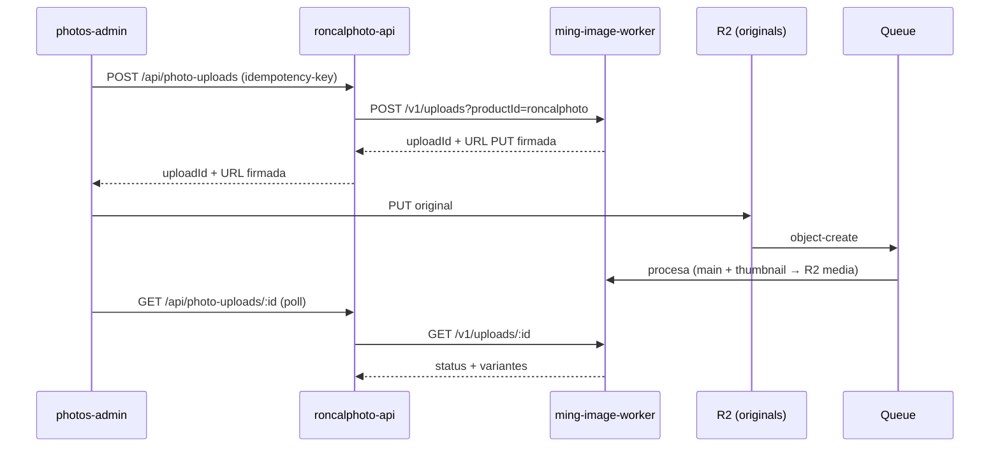

# 03 — Infraestructura Cloudflare

Todo el ecosistema corre sobre una única cuenta de Cloudflare
(`account_id = fee0d037c4a95bd94c997ee2a8b520be`). Este documento recopila qué
recursos se usan hoy, cómo se conectan y qué patrones operativos son
obligatorios. Es la base del documento [04](./04-reglas-backend-infra-nuevos-productos.md),
que extiende esta infraestructura al producto nuevo.

## Recursos en uso hoy

| Recurso                | Uso actual en RoncalPhoto                                                        |
| ---------------------- | ------------------------------------------------------------------------------- |
| **Workers**            | API (`roncalphoto-api`) y dos SPAs (`roncalphoto-photos`, `roncalphoto-admin`). |
| **D1**                 | `roncalphoto` (binding `DB_RONCALPHOTO`), SQLite remoto en prod.                 |
| **R2**                 | Originales y media procesada (propiedad del `ming-image-worker`).               |
| **Queues**             | Procesamiento asíncrono de imágenes (propiedad del `ming-image-worker`).        |
| **Service bindings**   | `EMAIL_WORKER → ming-email-worker`, `IMAGE_WORKER → ming-image-worker`.         |
| **Email Service**      | Envío transaccional (beta, requiere plan Paid) vía `ming-email-worker`.         |
| **Observability**      | `[observability] enabled = true` en la API; logs con pino.                       |

Recursos disponibles en la cuenta y **aún no usados** por RoncalPhoto, listos
para productos nuevos: **KV, Durable Objects, Workers AI, Vectorize, Cron
Triggers, Hyperdrive**. El documento 04 los aprovecha.

## Workers comunes: el patrón clave

RoncalPhoto **no** implementa email ni procesamiento de imágenes dentro de su
monorepo. Los delega en dos workers **standalone, multi-producto**, invocados
por _service binding_:

```text
Frontend/Cliente → API del producto → worker común (service binding) → Cloudflare
```

Reglas que definen un "worker común" (extraídas de la auditoría del email-worker):

1. **Es un servicio interno.** No tiene ruta pública, ni CORS, ni auth de
   navegador. Solo se invoca server-to-server por _service binding_.
2. **La capa pública y antiabuso vive en la API del producto** (CORS, Turnstile,
   rate limiting, validación Zod, respuesta neutra).
3. **Contrato estable y cerrado**, versionado, multi-producto. El consumidor se
   identifica con `productId` y selecciona perfiles/presets autorizados.
4. **No acepta contenido arbitrario** (ni HTML libre, ni transformaciones
   abiertas): registros cerrados de plantillas/presets.
5. **Despliegue propio fuera del monorepo**, con su propio estado (D1/R2/Queues).

### `ming-email-worker`

- Contrato único: `POST https://email-worker.internal/send?productId=roncalphoto`.
- Plantillas cerradas (`otp`, `contact-form`), perfiles de remitente
  (`roncalphoto-default` → `noreply@mail.murga.ing`), asunto definido por
  plantilla, nunca por el cliente.
- Consumido desde `packages/auth` para entregar el OTP. Ver
  [`email-worker-auditoria-worker-comun.md`](../email-worker-auditoria-worker-comun.md).

### `ming-image-worker`

- Dueño de su propio estado: D1 de subidas, transforms de Cloudflare Images,
  Queue + DLQ, bindings R2 de originales y media.
- Contrato consumido por la API: `POST /v1/uploads`, `GET /v1/uploads/:id`,
  `POST /v1/uploads/:id/retry` (con `productId` y `presetId`).
- El navegador solo recibe la **URL PUT firmada** de R2; sube el original
  directo a R2, y un `object-create` dispara la cola que genera variantes.



Este flujo es el **molde para cualquier media pesada**, incluidas las notas de voz.

## D1: migraciones

- Generación: `bun run db:generate` (drizzle-kit) en desarrollo. Nunca en deploy.
- Aplicación remota: `wrangler d1 migrations apply DB_RONCALPHOTO --remote`.
- `bun run deploy` aplica migraciones **antes** de subir el Worker; si una
  migración falla, no despliega.
- Cambios destructivos con **expand/contract**: esquema compatible → código que
  usa ambas formas → retirada de la forma vieja en una migración posterior.

## Separación credenciales de despliegue vs. runtime

Principio operativo crítico (detallado en [`cloudflare-production.md`](../cloudflare-production.md)):

- **Credenciales de despliegue** (`CLOUDFLARE_ACCOUNT_ID`, `CLOUDFLARE_API_TOKEN`)
  solo como variables de build/deploy. **Nunca** en `wrangler.toml [vars]`,
  runtime, `.dev.vars` ni `.env.example`.
- **Variables de runtime** no secretas en `wrangler.toml [vars]`; secretos
  (`BETTER_AUTH_SECRET`, claves R2, etc.) como _runtime secrets_.

## Targets de despliegue actuales

| App                 | Proyecto Cloudflare           | Tipo                       |
| ------------------- | ----------------------------- | -------------------------- |
| `apps/photos`       | `roncalphoto-photos`          | Worker (static assets SPA) |
| `apps/photos-admin` | `roncalphoto-admin`           | Worker (static assets SPA) |
| `apps/api`          | `roncalphoto-api`             | Worker                     |
| `ming-email-worker` | (repo standalone)             | Worker común               |
| `ming-image-worker` | (repo standalone)             | Worker común               |

Orden de despliegue: primero los workers comunes (para que resuelvan los service
bindings), luego la API (con sus migraciones), y al final los frontends.

## Desarrollo local

- API en `:8787` con `wrangler dev` (usa **recursos remotos reales**: D1, R2).
- Admin en `:5173`, photos en `:5174`.
- `apps/api/.dev.vars` requiere `BETTER_AUTH_SECRET`, `BETTER_AUTH_URL`, `PHOTOS_ADMIN_URL`.

## Catálogo de servicios Cloudflare para productos nuevos

Referencia rápida de cuándo usar cada recurso (aplicado en el doc 04):

| Servicio            | Cuándo usarlo                                                                          |
| ------------------- | -------------------------------------------------------------------------------------- |
| **D1**              | Datos relacionales transaccionales (usuarios, perfiles, conversaciones, streaks).      |
| **R2**             | Binarios pesados (audio de notas de voz, imágenes desbloqueadas). Acceso por URL firmada. |
| **KV**              | Lecturas calientes eventualmente consistentes: caché de descubrimiento, flags, presencia ligera. |
| **Queues**          | Procesamiento asíncrono desacoplado (transcodificar/moderar audio).                    |
| **Durable Objects** | Estado fuerte por entidad + tiempo real: presencia, coordinación de streak, WebSocket de chat. |
| **Workers AI**      | Transcripción de voz, moderación/clasificación de contenido, embeddings.               |
| **Vectorize**       | Búsqueda por similitud (matching opcional por intereses/embeddings).                   |
| **Cron Triggers**   | Tareas programadas (recalcular streaks a medianoche, expirar contenido, limpiar R2).   |
| **Email Service**   | OTP y notificaciones transaccionales vía `ming-email-worker`.                          |
