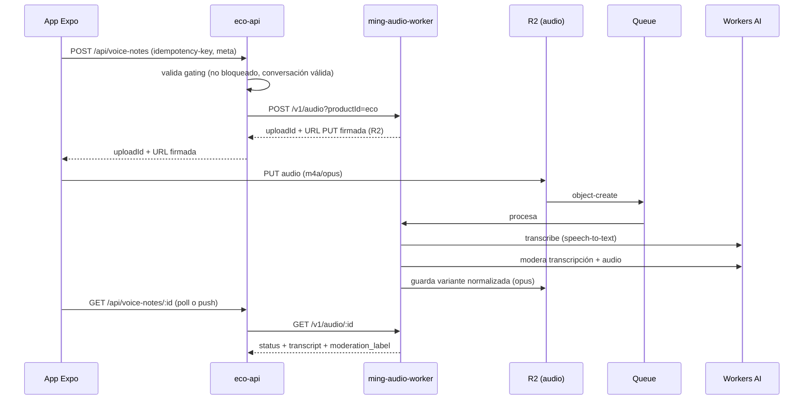

# 04 — Reglas de backend e infraestructura para productos nuevos

**Documento normativo.** Define cómo se construye el backend y la
infraestructura de un producto nuevo dentro de esta cuenta de Cloudflare,
reutilizando los patrones de RoncalPhoto (documentos [02](./02-arquitectura-backend.md)
y [03](./03-infraestructura-cloudflare.md)) y los workers comunes existentes.

El caso de aplicación es una **app de citas cuya mecánica central es la
comunicación por notas de voz**. Cliente en **React Native + Expo**. Nombre de
trabajo: **Eco** (sustituible). Las decisiones se expresan como reglas (`DEBE` /
`NO DEBE` / `DEBERÍA`) para que sean auditables.

---

## 1. Concepto del producto y su traducción técnica

| Regla de producto                                                        | Implicación técnica                                                                                   |
| ------------------------------------------------------------------------ | ----------------------------------------------------------------------------------------------------- |
| Hombres y mujeres se descubren por **radio / ciudad / país**.            | Servicio de descubrimiento geográfico (geohash en D1 + caché en KV). Sin geolocalización exacta expuesta. |
| Cada perfil muestra una **descripción corta**.                           | Tabla `profiles` mínima; el cliente no envía imágenes al inicio.                                       |
| El contacto se inicia **enviando una nota de voz**. No hay chat ni imágenes. | Pipeline de audio asíncrono (R2 + Queue + Workers AI). Chat e imágenes **deshabilitados por defecto**. |
| **Streak de 10 días seguidos hablando** desbloquea chat e imágenes.      | Contador de streak server-authoritative + sistema de _gates_ de capacidades.                          |
| Seguridad (es una app de citas).                                         | Moderación de audio (transcripción + clasificación con Workers AI), reportes, bloqueos.               |

**Principio rector heredado:** la API del producto es la única autoridad de
negocio; el cliente Expo solo la consume. Los workers comunes
(`ming-email-worker`, y un **nuevo `ming-audio-worker`**) son servicios internos
invocados por _service binding_, nunca expuestos al cliente.

---

## 2. Topología de despliegue

```text
┌─────────────────────┐      ┌──────────────────────┐
│  App Expo (iOS/And.) │ ───▶ │  eco-api (Worker)    │
└─────────────────────┘      │  Hono + D1 + bindings │
                             └──────────┬───────────┘
        service bindings ───────────────┼───────────────────────────
                          │             │                │
                 ┌────────▼──────┐ ┌────▼────────┐ ┌─────▼─────────┐
                 │ ming-email-   │ │ ming-audio- │ │ Durable       │
                 │ worker (común)│ │ worker(nuevo)│ │ Objects (RT)  │
                 └───────────────┘ └─────┬───────┘ └───────────────┘
                                          │
                              ┌───────────▼───────────┐
                              │ R2 audio · Queue · AI  │
                              └───────────────────────┘
```

| Pieza                | Tipo                         | Regla                                                                              |
| -------------------- | ---------------------------- | ---------------------------------------------------------------------------------- |
| `eco-api`            | Worker (Hono)                | Única superficie pública. Aplica auth, CORS, rate limiting, validación, moderación gating. |
| `ming-email-worker`  | Worker común (reutilizado)   | OTP de acceso y notificaciones transaccionales. Se añade `productId=eco`.          |
| `ming-audio-worker`  | Worker común (**nuevo**)     | Pipeline de notas de voz: ingest, transcode, transcripción, moderación. Service binding. |
| Durable Objects      | dentro de `eco-api` o worker dedicado | Tiempo real: presencia, coordinación de conversación, WebSocket de chat (tras desbloqueo). |
| App Expo             | Cliente nativo               | NO contiene lógica de negocio sensible ni secretos de servidor.                    |

> **Regla de reutilización:** NO se reimplementa email dentro de `eco`. Se
> reutiliza `ming-email-worker` añadiendo un `productId`, un perfil de remitente
> (`eco-default`) y las plantillas necesarias (`otp`, etc.), siguiendo su
> contrato cerrado.

---

## 3. El backend `eco-api`

Replica **exactamente** la arquitectura del documento 02:

- Hono + `@hono/zod-openapi`, capas `routes → services → repositories → db`.
- Módulos aislados (no se importan entre sí); lo común en `src/shared/`.
- Services/repositories como singletons cacheados por binding (`WeakMap`).
- D1 + Drizzle, IDs string, migraciones expand/contract.
- Envelope `{ success, data | error }`, `HttpError`, `onErrorHandler`.

### 3.1 Módulos propuestos

| Módulo            | Responsabilidad                                                                              |
| ----------------- | -------------------------------------------------------------------------------------------- |
| `auth`            | OTP de acceso vía `ming-email-worker`, sesiones (Better Auth, `packages/auth`).              |
| `profiles`        | Perfil mínimo: nombre, género, descripción corta, preferencias, ubicación aproximada.        |
| `discovery`       | Búsqueda por radio/ciudad/país. Devuelve tarjetas con descripción corta (sin datos sensibles). |
| `voice-notes`     | Subida idempotente de notas de voz (patrón `pending_*` + R2 + `ming-audio-worker`).          |
| `conversations`   | Hilo entre dos usuarios; estado, participantes, última actividad.                            |
| `streaks`         | Contador server-authoritative de días consecutivos con intercambio válido.                   |
| `capabilities`    | _Gates_: qué puede hacer una conversación (voz siempre; chat/imagen según streak).           |
| `chat`            | Mensajería de texto, **deshabilitada hasta desbloqueo**. Tiempo real con Durable Object.     |
| `media-unlocks`   | Envío de imágenes con cuota ("cada tanto"), habilitado tras streak.                          |
| `safety`          | Reportes, bloqueos, resultados de moderación, sanciones.                                     |

> Los módulos **NO** se importan entre sí. Si `conversations` necesita saber si
> hay chat habilitado, llama a `capabilities` a través de `src/shared/` o de un
> contrato interno, nunca importando el módulo `chat`.

### 3.2 Modelo de datos (D1, esquema mínimo)

```text
users(id, …)                         # Better Auth
profiles(user_id, display_name, gender, bio_short, birthdate,
         country, city, geohash, discovery_radius_km, created_at)
conversations(id, user_a, user_b, status, created_at, last_interaction_at,
              streak_count, streak_last_day, chat_unlocked_at)
voice_notes(id, conversation_id, sender_id, r2_key, duration_ms,
            status ∈ {awaiting_upload, queued, processing, ready, rejected, error},
            transcript, moderation_label, created_at)
pending_voice_uploads(id, idempotency_key UNIQUE, request_fingerprint,
                      voice_note_id, conversation_id, sender_id,
                      status ∈ {pending, finalized}, created_at)
streak_days(conversation_id, day, user_a_spoke, user_b_spoke)   # PK (conversation_id, day)
messages(id, conversation_id, sender_id, body, created_at)      # solo si chat desbloqueado
reports(id, reporter_id, target_id, voice_note_id?, reason, created_at)
blocks(blocker_id, blocked_id, created_at)                       # PK compuesta
```

Reglas de esquema:

- Toda media (audio/imagen) vive en **R2**; D1 guarda solo la **clave R2** y metadatos.
- Los estados asíncronos son columnas `status` con enum acotado (igual que `photo_upload_jobs`).
- `geohash` indexado para descubrimiento por proximidad; nunca se expone la coordenada exacta.

---

## 4. Pipeline de notas de voz (`ming-audio-worker`)

Es el corazón del producto y el equivalente directo del `ming-image-worker`. Se
crea como **worker común nuevo, standalone**, siguiendo las cinco reglas de
worker común del [documento 03](./03-infraestructura-cloudflare.md): servicio
interno, sin ruta pública, contrato cerrado, multi-producto, estado propio.

### 4.1 Flujo



### 4.2 Reglas del pipeline

1. **Subida idempotente** idéntica a `pending_photo_uploads`: `idempotency_key`
   único + `request_fingerprint` (SHA-256 del payload normalizado) → `409` si se
   reutiliza la clave con otro contenido.
2. El cliente **sube el audio directo a R2** con URL firmada; el binario nunca
   pasa por la API. La API solo orquesta y guarda metadatos.
3. **Procesamiento asíncrono por Queue** (con DLQ). Estados:
   `awaiting_upload → queued → processing → ready | rejected | error`.
4. **Transcripción y moderación con Workers AI** dentro del worker de audio:
   speech-to-text + clasificación de toxicidad/abuso. La nota solo se marca
   `ready` (y se hace visible al receptor) si pasa moderación; si no, `rejected`.
5. **Límites duros**: duración máxima (p. ej. 60 s), tamaño máximo, formatos
   permitidos (`audio/m4a`, `audio/opus`). Validados en la API antes de firmar la URL.
6. El cliente conoce el resultado por **polling** (patrón actual) o por **push**
   (Durable Object / notificación). Ambos válidos; empezar por polling.

> **Regla de reutilización vs. creación:** se valora extender `ming-image-worker`
> a "media-worker" genérico. Decisión por defecto: **worker separado**
> (`ming-audio-worker`), porque audio tiene transcodificación, transcripción y
> moderación propias. La forma del contrato (`/v1/<media>`, `productId`,
> idempotencia, URL firmada, poll de estado) **DEBE** ser la misma.

---

## 5. Descubrimiento geográfico

El cliente se descubre por **radio, ciudad o país**.

- **País / ciudad**: filtro directo en D1 sobre `profiles.country` / `profiles.city`.
- **Radio**: D1 no hace geo nativo. Estrategia:
  1. Guardar `geohash` del usuario (precisión limitada, p. ej. 5–6 chars → ~1–5 km).
  2. Filtrar candidatos por prefijos de geohash vecinos (consulta indexada).
  3. Afinar la distancia (haversine) en el service sobre el conjunto reducido.
- **Caché en KV**: el resultado de descubrimiento por celda geográfica se cachea
  en **KV** (eventual, TTL corto) para evitar recomputar las tarjetas en cada scroll.
- **Privacidad (regla dura):** NO se expone la coordenada exacta de nadie. El
  cliente envía su ubicación con precisión reducida; la API persiste solo geohash
  truncado. La distancia se devuelve como aproximación ("a ~3 km"), no como punto.

---

## 6. Mecánica de streak y desbloqueo de capacidades

### 6.1 Definición server-authoritative

- Un **"día con conversación válida"** se contabiliza cuando **ambos** usuarios
  enviaron al menos una nota de voz `ready` (moderada) dentro del mismo día
  (zona horaria fija del servidor, p. ej. UTC) → fila en `streak_days`.
- El cliente **NUNCA** decide el streak. Lo calcula la API:
  `streak_count` se incrementa solo si el día anterior también fue válido; si se
  rompe un día, se resetea a 0.
- Un **Cron Trigger** a medianoche cierra el día y consolida/rompe streaks
  pendientes. Alternativamente, recálculo perezoso al leer la conversación.

### 6.2 Gates de capacidades

El módulo `capabilities` resuelve, por conversación, qué está permitido:

```text
voice_note   → SIEMPRE permitido (núcleo del producto)
text_chat    → permitido si streak_count ≥ 10
image_send   → permitido si streak_count ≥ 10, con cuota (p. ej. 1 cada 24 h)
```

Reglas:

- El gating es **server-side**. El cliente puede ocultar la UI de chat, pero la
  API **DEBE** rechazar (`403`) cualquier mensaje de texto o imagen si la
  capacidad no está desbloqueada para esa conversación.
- El desbloqueo se persiste (`chat_unlocked_at`) y es **irreversible** por diseño
  (romper el streak después no vuelve a bloquear el chat ya ganado — decisión de
  producto a confirmar; el sistema soporta ambas).
- Las **imágenes** desbloqueadas reutilizan el `ming-image-worker` existente
  (`productId=eco`, preset propio) con su moderación, NO un flujo nuevo.

---

## 7. Tiempo real (Durable Objects)

Las notas de voz no necesitan tiempo real (asíncronas, con polling). El **chat de
texto desbloqueado** y la **presencia** sí se benefician:

- Un **Durable Object por conversación** coordina: presencia ("está
  escribiendo"/online), entrega de mensajes en vivo (WebSocket), y es el punto de
  serialización del estado de la conversación.
- Regla: el Durable Object **no** sustituye a D1 como verdad persistente; D1
  guarda los mensajes, el DO orquesta el tiempo real y hace flush a D1.
- Empezar simple: si el chat inicial puede ser por polling, **posponer** Durable
  Objects hasta que el tiempo real sea un requisito real (medir antes de optimizar).

---

## 8. Seguridad y moderación (obligatorio en una app de citas)

| Control                    | Dónde                                  | Regla                                                                       |
| -------------------------- | -------------------------------------- | --------------------------------------------------------------------------- |
| Moderación de audio        | `ming-audio-worker` (Workers AI)       | Transcribir + clasificar. Solo notas `ready` se entregan. Resto `rejected`. |
| Moderación de texto        | `eco-api` / Workers AI                 | Filtrar mensajes de chat tras desbloqueo.                                    |
| Moderación de imágenes     | `ming-image-worker`                    | Reutilizar su moderación. Sin desnudez no consentida, etc.                   |
| Bloqueos                   | módulo `safety` (D1 `blocks`)          | Un usuario bloqueado NO aparece en discovery ni puede enviar notas.          |
| Reportes                   | módulo `safety` (D1 `reports`)         | Cualquier nota/usuario reportable; cola de revisión.                        |
| Rate limiting / antiabuso  | `eco-api` (KV)                         | Límite de notas por usuario/hora; límite de contactos nuevos por día.       |
| Privacidad de ubicación    | `discovery`                            | Geohash truncado, nunca coordenada exacta (ver §5).                          |

Reglas duras:

- La **moderación es server-side y previa a la entrega**. El receptor nunca recibe
  audio sin moderar.
- El antiabuso (rate limiting, captcha si aplica, validación) vive en `eco-api`,
  **no** en los workers comunes (igual que en RoncalPhoto).
- Datos sensibles (ubicación, audio) cifrados en tránsito; R2 con acceso solo por
  URL firmada y de vida corta.

---

## 9. Autenticación (cliente Expo)

- Reutilizar **Better Auth** vía `packages/auth` (o un paquete `@eco/auth`
  análogo). Mecanismo: **OTP** entregado por `ming-email-worker` (`template: otp`,
  `productId=eco`, perfil `eco-default`).
- Para móvil, el OTP por email es válido; si se quiere OTP por SMS, se modela como
  otra plantilla/canal del worker común, **no** como lógica en el cliente.
- Tokens de sesión almacenados de forma segura en el dispositivo
  (`expo-secure-store`). El cliente **NO** guarda secretos de servidor.

---

## 10. Mapa de infraestructura del producto

| Necesidad                              | Recurso Cloudflare         | Binding (sugerido)        |
| -------------------------------------- | -------------------------- | ------------------------- |
| Datos relacionales                     | D1                         | `DB_ECO`                  |
| Audio y media binaria                  | R2 (propiedad audio-worker)| (interno del worker)      |
| Caché de discovery / presencia / flags | KV                         | `ECO_KV`                  |
| Procesado asíncrono de audio           | Queues (+ DLQ)             | (interno del worker)      |
| Transcripción y moderación             | Workers AI                 | `AI`                      |
| Tiempo real (chat/presencia)           | Durable Objects            | `CONVERSATION_DO`         |
| Matching por similitud (opcional)      | Vectorize                  | `ECO_VECTORS`             |
| Cierre de día / streaks / limpieza     | Cron Triggers              | (trigger en `eco-api`)    |
| Email OTP / notificaciones             | `ming-email-worker`        | `EMAIL_WORKER`            |
| Pipeline de notas de voz               | `ming-audio-worker`        | `AUDIO_WORKER`            |
| Imágenes (post-desbloqueo)             | `ming-image-worker`        | `IMAGE_WORKER`            |

Todos los _service bindings_ se tipan en `src/config/env/schema.ts` con
`z.custom<...>` comprobando `fetch`, igual que `EMAIL_WORKER`/`IMAGE_WORKER` hoy.

---

## 11. Reglas operativas heredadas (no negociables)

1. **Workers comunes = servicios internos.** Sin ruta pública, sin CORS, sin auth
   de navegador/cliente. Solo _service binding_.
2. **La API es la única superficie pública** y la única autoridad de negocio.
3. **Separación deploy creds vs. runtime** (ver [`cloudflare-production.md`](../cloudflare-production.md)).
4. **Migraciones expand/contract**; `db:generate` en dev, `db:migrate --remote` en deploy.
5. **Idempotencia** en toda subida de media (`idempotency_key` + `request_fingerprint`).
6. **Bun**; `strict: true`; sin `any`; Zod en los límites; ESLint enforce de capas.
7. **Tipos de dominio no nullables** compartidos en un paquete `@eco/shared`.
8. **Medir antes de optimizar**: empezar con polling y D1; añadir Durable Objects,
   Vectorize o push solo cuando haya un requisito medido.

---

## 12. Orden de arranque recomendado

1. Crear `ming-audio-worker` (standalone): contrato `/v1/audio`, R2, Queue+DLQ,
   Workers AI, presets `eco`.
2. Extender `ming-email-worker` con `productId=eco`, perfil `eco-default`, plantillas.
3. Andamiar `eco-api`: factory Hono, `packages/auth`, módulos `auth` y `profiles`.
4. Módulo `discovery` (geohash + KV).
5. Módulo `voice-notes` (subida idempotente + binding al audio-worker).
6. Módulos `conversations` + `streaks` + `capabilities` (la mecánica central).
7. `safety` (bloqueos, reportes, moderación gating).
8. `chat` + `media-unlocks` (solo tras tener streaks funcionando).
9. Tiempo real con Durable Objects (si se mide su necesidad).
10. Cron Triggers para cierre de día y limpieza de R2.

> Este orden entrega primero el "loop" mínimo viable: descubrir → enviar nota de
> voz → recibir nota de voz moderada → acumular streak. El chat y las imágenes
> son la recompensa desbloqueable, construidos al final.
