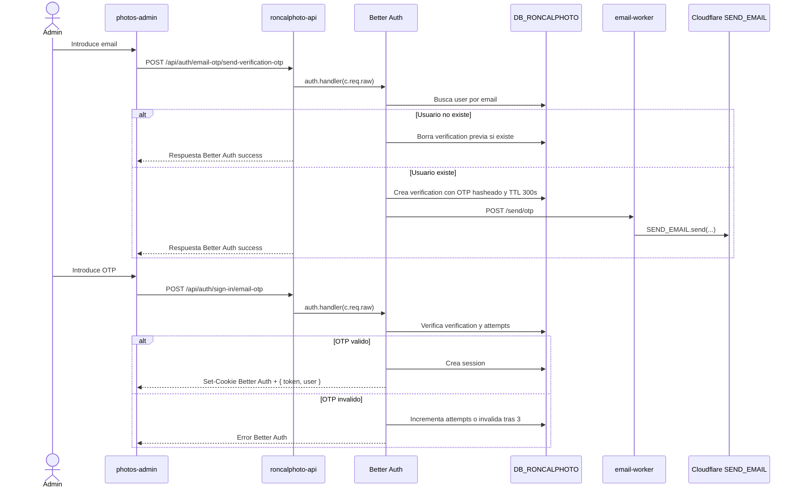
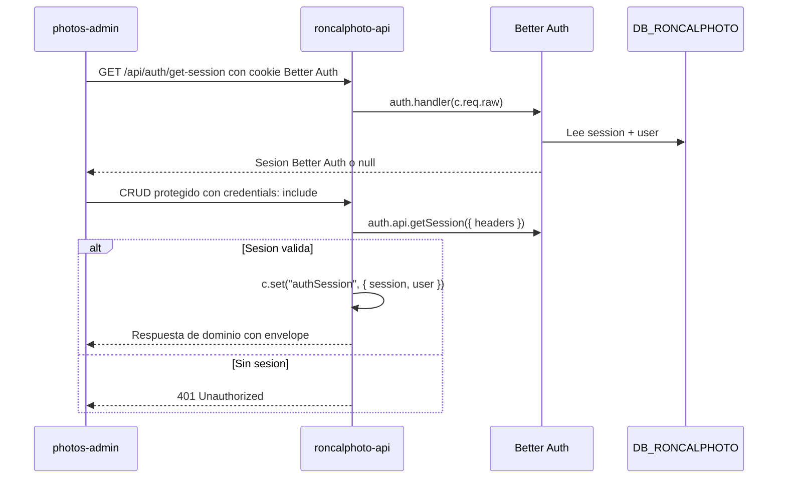

# Guia del flujo de autenticacion de RoncalPhoto

> Fuente canonica: este documento describe el auth admin OTP actual. Referencias cruzadas:
> [`README.md`](../README.md), [`apps/api/README.md`](../apps/api/README.md),
> [`apps/email-worker/README.md`](../apps/email-worker/README.md), [`packages/README.md`](../packages/README.md).

## 1. Resumen

El dashboard admin (`apps/photos-admin`) usa Better Auth con Email OTP. No hay sign-up publico: el administrador debe existir previamente en la tabla Better Auth `user` de D1.

La API (`apps/api`) monta Better Auth en `/api/auth/*` con `auth.handler(c.req.raw)`. Las rutas protegidas de dominio usan `auth.api.getSession({ headers })` desde `requireSession`.

D1 es la fuente de verdad para las tablas `user`, `session`, `verification` y `account`. El email-worker se mantiene como transporte de entrega del OTP (`POST /send/otp`), no guarda ni valida codigos. El KV de auth antiguo, la cookie custom anterior y las sesiones manuales antiguas ya no se usan.

Tras desplegar este cambio, las sesiones antiguas no migran: los admins deben iniciar sesion de nuevo.

## 2. Flujo OTP



## 3. Sesion Y Proteccion



## 4. Componentes

| Archivo | Responsabilidad |
|---------|-----------------|
| `packages/auth/src/index.ts` | Factory `createAuth(...)`, configuracion de Drizzle adapter, Email OTP y helper `createEmailWorkerOtpSender(...)`. |
| `packages/auth/src/client.ts` | Factory `createEmailOtpAuthClient({ baseURL })` con `better-auth/react` y `emailOTPClient()`. |
| `apps/api/src/auth.ts` | Cachea instancias por `D1Database`, delega `/api/auth/*` a Better Auth y expone `requireSession`. |
| `apps/api/src/db/schema/auth.ts` | Tablas Better Auth `user`, `session`, `account`, `verification`. |
| `apps/api/src/db/schema/index.ts` | Exporta tambien el schema Better Auth para que Drizzle runtime lo entregue al adapter. |
| `apps/api/src/app/create-app.ts` | CORS dedicado para `/api/auth/*` con `credentials: true` y montaje de `authHandler`. |
| `apps/api/src/config/env.ts` | Valida `BETTER_AUTH_SECRET`, `BETTER_AUTH_URL`, `PHOTOS_ADMIN_URL` y configuracion del email-worker. |
| `apps/photos-admin/src/lib/auth-client.ts` | Crea el cliente Better Auth apuntando a `${resolveApiBaseUrl(...)}/api/auth`. |
| `apps/photos-admin/src/app/routes/login.tsx` | Usa `authClient.emailOtp.sendVerificationOtp(...)` y `authClient.signIn.emailOtp(...)`. |

## 5. Configuracion

| Variable / binding | Worker | Uso |
|--------------------|--------|-----|
| `DB_RONCALPHOTO` | `roncalphoto-api` | D1 con tablas de dominio y Better Auth. |
| `BETTER_AUTH_SECRET` | `roncalphoto-api` | Secreto de firma, hashing y cifrado de Better Auth. |
| `BETTER_AUTH_URL` | `roncalphoto-api` | Origen canonico de la API; produccion usa `https://api.murga.ing`. |
| `PHOTOS_ADMIN_URL` | `roncalphoto-api` | Origen canonico del dashboard para trusted origins y CORS. |
| `EMAIL_WORKER` | `roncalphoto-api` | Service binding hacia el email-worker para el envio de OTPs. |

Produccion usa cookies cross-site de Better Auth porque admin y API viven en dominios distintos: `SameSite=None`, `Secure` y `Partitioned`. En local se usan cookies same-site.

`/api/auth/*` no usa el envelope `{ success, data }` del dominio; responde con el contrato nativo de Better Auth. Las rutas `/api/sessions`, `/api/photos` y `/api/tags` conservan el envelope actual.

## 6. Primeras pruebas en Cloudflare Dashboard

Sigue estos pasos para validar el flujo OTP en produccion o staging desde el dashboard de Cloudflare. Asume que el dominio de envio de email (`mail.murga.ing`) ya esta verificado y funciona.

### 6.1 Verificar migraciones en D1

1. Ve a **Workers & Pages > D1** y selecciona `DB_RONCALPHOTO`.
2. Abre la pestana **Console** o usa el editor SQL.
3. Asegurate de que las tablas de Better Auth existen:

```sql
SELECT name FROM sqlite_master WHERE type='table' AND name IN ('user','session','account','verification');
```

Debe devolver las 4 filas. Si falta alguna, aplica la migracion `0004_better_auth.sql` (o la que corresponda en tu historial de migraciones de Drizzle).

### 6.2 Crear el primer usuario administrador

Como `disableSignUp: true`, no puedes registrarte desde la UI. Inserta el usuario directamente en D1:

```sql
INSERT INTO user (id, name, email, emailVerified, image, createdAt, updatedAt)
VALUES (
  lower(hex(randomblob(16))),
  'Administrador',
  'tu-email@murga.ing',
  true,
  NULL,
  (strftime('%s','now') * 1000),
  (strftime('%s','now') * 1000)
);
```

Ajusta `email` al correo real del administrador. El valor de `createdAt` y `updatedAt` es un timestamp en milisegundos (formato que espera Better Auth con el adapter SQLite).

### 6.3 Configurar secrets y variables del worker `roncalphoto-api`

Ve a **Workers & Pages > roncalphoto-api > Settings > Variables and Secrets** y configura:

| Tipo | Nombre | Valor de ejemplo / instruccion |
|------|--------|-------------------------------|
| Secret | `BETTER_AUTH_SECRET` | Genera un string aleatorio de 32+ caracteres (por ejemplo con `openssl rand -base64 32`). |
| Plain text | `BETTER_AUTH_URL` | `https://api.murga.ing` (tu origen canonico de la API). |
| Plain text | `PHOTOS_ADMIN_URL` | `https://admin.tudominio.com` (origen exacto del dashboard admin). |

### 6.4 Configurar el service binding `EMAIL_WORKER`

1. En el mismo worker `roncalphoto-api`, ve a **Settings > Triggers > Service bindings**.
2. Anade un binding llamado `EMAIL_WORKER` que apunte al worker `roncalphoto-email-worker`.
3. Guarda y redeploya.

### 6.5 Verificar el dominio de email

Confirma que el worker `roncalphoto-email-worker` esta configurado para enviar desde `mail.murga.ing`:

- Ve a **Workers & Pages > roncalphoto-email-worker > Settings**.
- Verifica que la API de `SEND_EMAIL` del dominio `mail.murga.ing` esta habilitada en **Email > Email Routing > Send Email**.
- Si usas un DNS custom, asegurate de que el registro SPF/DKIM de `mail.murga.ing` este activo.

### 6.6 Smoke test desde el admin

1. Abre el dashboard admin en su URL de produccion.
2. Ingresa el email del usuario creado en el paso 6.2.
3. Revisa la bandeja de entrada: debe llegar un email con el OTP de 6 digitos desde `mail.murga.ing`.
4. Ingresa el OTP. Si es valido, se creara una fila en `session` y el admin estara autenticado.
5. Usa las herramientas de desarrollador del navegador para confirmar que la cookie de Better Auth tiene:
   - `SameSite=None`
   - `Secure`
   - `Partitioned` (en Chrome)
6. Cierra sesion (`signOut`) y verifica que la fila `session` correspondiente se elimina o invalida.

## 7. Validacion

Comandos esperados:

```bash
bun run --filter=@roncal/auth check
bun run --filter=@roncal/api check
bun run --filter=@roncal/photos-admin check
bun run lint
bun run build
```

Smoke test local con `wrangler dev`:

- Levanta `apps/email-worker` junto a `apps/api` para que el service binding `EMAIL_WORKER` aparezca conectado durante el desarrollo local.
- Usuario existente en D1 recibe OTP.
- Usuario inexistente obtiene respuesta exitosa, no recibe email y no crea usuario.
- OTP valido crea fila en `session`, usa `verification` y permite CRUD protegido.
- OTP invalido falla y respeta el maximo de 3 intentos.
- `GET /api/auth/get-session` devuelve sesion con cookie valida.
- `signOut` invalida la sesion Better Auth.

Validacion en staging/produccion:

- `Set-Cookie` incluye `SameSite=None`, `Secure` y `Partitioned`.
- El admin envia `credentials: include`.
- CORS de `/api/auth/*` responde con `credentials: true` y el origin del admin.
- El deploy ya no requiere ningun binding KV para auth.
