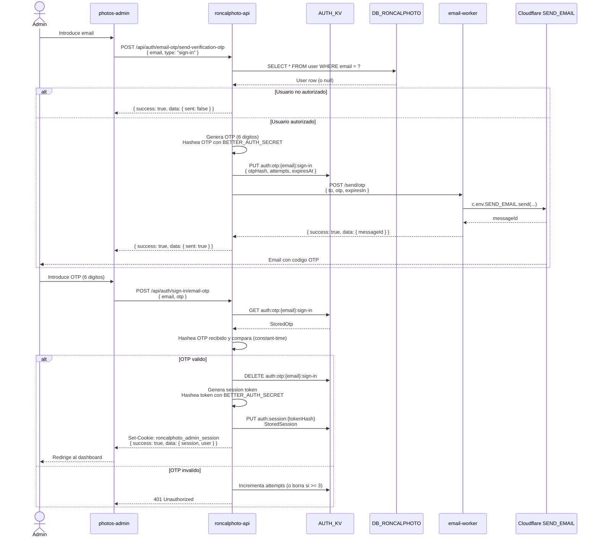
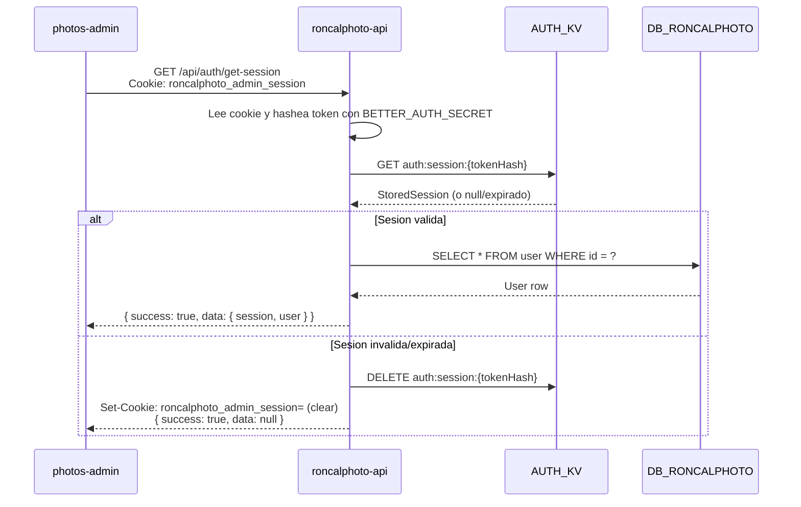
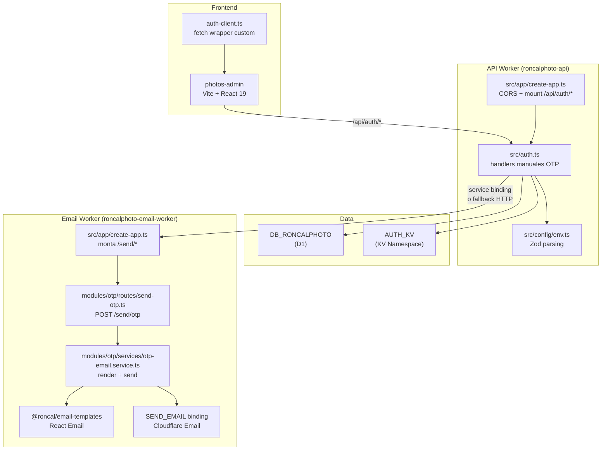

# Guia del flujo de autenticacion de RoncalPhoto

> Fuente canonica: este documento describe como funciona el auth admin OTP en el monorepo RoncalPhoto, que piezas de codigo intervienen y que configuracion se requiere en Cloudflare para ponerlo en produccion.
>
> Referencias cruzadas: [`README.md`](../README.md), [`apps/api/README.md`](../apps/api/README.md), [`apps/email-worker/README.md`](../apps/email-worker/README.md), [`packages/README.md`](../packages/README.md).

---

## 1. Resumen ejecutivo

El dashboard admin (`apps/photos-admin`) usa **autenticacion por OTP via email**. No hay sign-up publico: el administrador debe existir previamente en la tabla `user` de D1.

La API (`apps/api`) implementa sus **propios handlers HTTP manuales** para el flujo de auth en `src/auth.ts`. No monta Better Auth en runtime, pero si reutiliza las utilidades criptograficas y de KV de `@roncal/auth` (OTP, hashing HMAC-SHA256, generacion de tokens, etc.). Esta decision esta documentada en [`apps/api/README.md`](../apps/api/README.md) bajo *"Custom auth instead of Better Auth endpoints"*.

El worker de email (`apps/email-worker`) expone un unico endpoint protegido (`POST /send/otp`) que renderiza la plantilla React Email y la envia a traves del binding nativo `SEND_EMAIL` de Cloudflare.

---

## 2. Diagramas de flujo

### 2.1 Secuencia OTP (login)



### 2.2 Validacion de sesion



### 2.3 Arquitectura de componentes



---

## 3. Check de implementacion de codigo

### 3.1 Componentes implementados

| Archivo | Estado | Descripcion |
|---------|--------|-------------|
| `apps/api/src/auth.ts` | Listo | Handlers manuales para get-session, send-verification-otp, sign-in/email-otp, sign-out. Usa raw SQL en D1 + KV. |
| `apps/api/src/app/create-app.ts` | Listo | Monta CORS dedicado para `/api/auth/*` y registra `authHandler`. |
| `apps/api/src/config/env.ts` | Listo | Parseo de `AUTH_KV`, `BETTER_AUTH_SECRET`, `EMAIL_WORKER`, etc. |
| `apps/email-worker/src/index.ts` | Listo | Entrypoint minimo que exporta `fetch: app.fetch`. |
| `apps/email-worker/src/app/create-app.ts` | Listo | Crea la app Hono, registra middleware `X-Api-Key`, rutas y handlers de error. |
| `apps/email-worker/src/modules/otp` | Listo | Endpoint `POST /send/otp`, validacion del payload y servicio que renderiza OTP + llama `SEND_EMAIL`. |
| `packages/auth/src/store.ts` | Listo | Primitivas cripto: `generateOtp`, `hashOtp`, `hashSessionToken`, `createAuthStore`, etc. |
| `packages/email-templates` | Listo | Plantilla React Email para OTP. |
| `apps/photos-admin/src/app/routes/login.tsx` | Listo | UI de login de 2 pasos (email -> OTP). |
| `apps/photos-admin/src/app/routes/_auth.tsx` | Listo | Guard de ruta que redirige a `/login` si no hay sesion. |
| `apps/photos-admin/src/components/shell/admin-shell.tsx` | Listo | Boton de logout con `signOut()`. |
| `apps/photos-admin/src/lib/auth-client.ts` | **Creado** | Wrapper de `fetch` que habla con los endpoints manuales de la API en lugar del cliente de Better Auth. |

### 3.2 Configuracion de wrangler.toml

| App | Cambio realizado |
|-----|------------------|
| `apps/api/wrangler.toml` | Agregado binding `AUTH_KV` con placeholder `id`. Mantiene los origins admin/public actuales para CORS. |
| `apps/email-worker/wrangler.toml` | Actualizado `FROM_EMAIL` a `noreply@mail.murga.ing`. |

### 3.3 Secrets requeridos

| Secret | Worker | Comando |
|--------|--------|---------|
| `BETTER_AUTH_SECRET` | `roncalphoto-api` | `wrangler secret put BETTER_AUTH_SECRET --name roncalphoto-api` |
| `EMAIL_WORKER_API_KEY` | `roncalphoto-api` | Solo si se usa fallback HTTP: `wrangler secret put EMAIL_WORKER_API_KEY --name roncalphoto-api` |
| `WORKER_API_KEY` | `roncalphoto-email-worker` | Solo si se usa fallback HTTP: `wrangler secret put WORKER_API_KEY --name roncalphoto-email-worker` |

> **Nota**: `EMAIL_WORKER_API_KEY` (en la API) y `WORKER_API_KEY` (en el email-worker) deben coincidir cuando se use el fallback HTTP en lugar del service binding. En produccion con service binding, no configures `WORKER_API_KEY` en el email-worker a menos que la API tambien envie `X-Api-Key`; si esta configurado, el middleware del email-worker rechazara la llamada interna con `401`.

---

## 4. Instrucciones paso a paso en Cloudflare Dashboard

### 4.1 Pre-requisitos

- Cuenta de Cloudflare con `api.murga.ing` configurado para la API, `mail.murga.ing` verificado para Email Routing y los origins admin/public actuales (`admin.estudioroncal.com`, `estudioroncal.com`) configurados segun corresponda.
- Wrangler CLI autenticado (`wrangler login`).
- D1 database `roncalphoto` creada y migrada (ver [`apps/api/README.md`](../apps/api/README.md)).

### 4.2 Paso 1: Crear el KV Namespace para sesiones y OTP

1. Ve al [Cloudflare Dashboard](https://dash.cloudflare.com).
2. Navega a **Workers & Pages > KV**.
3. Haz clic en **Create a namespace**.
4. Nombra la namespace: `AUTH_KV`.
5. Copia el **Namespace ID** que Cloudflare genera.
6. Abre `apps/api/wrangler.toml`.
7. Reemplaza el placeholder:
   ```toml
   [[kv_namespaces]]
   binding = "AUTH_KV"
   id = "replace-with-kv-namespace-id"
   ```
   por el ID real:
   ```toml
   [[kv_namespaces]]
   binding = "AUTH_KV"
   id = "xxxxx-xxxxx-xxxxx"
   ```

### 4.3 Paso 2: Configurar Email Routing (remitente verificado)

El worker de email usa el binding `SEND_EMAIL`, que requiere un remitente verificado en Cloudflare Email Routing.

1. En el dashboard, ve a tu zona `mail.murga.ing`.
2. Navega a **Email > Email Routing**.
3. Activa Email Routing si no esta activo.
4. Ve a **Routing rules > Destination addresses** y agrega `noreply@mail.murga.ing` como direccion de destino.
5. Verifica la direccion (Cloudflare enviara un email de confirmacion).
6. Ve a **Routing rules > Routing rules** y crea una regla que capture los correos del remitente que vayas a usar (aunque para el binding `SEND_EMAIL` solo se necesita que el dominio tenga Email Routing activo y el remitente verificado).

> **Importante**: `SEND_EMAIL` es un binding nativo de Cloudflare Workers para envio transaccional. No requiere SMTP externo.

### 4.4 Paso 3: Service Binding `EMAIL_WORKER`

En produccion, la API llama al email-worker mediante un **service binding** (comunicacion interna entre Workers), no por HTTP.

1. En el dashboard, ve a **Workers & Pages > roncalphoto-api**.
2. Ve a la pestana **Settings > Bindings**.
3. Haz clic en **Add**.
4. Tipo: **Service**.
5. Variable name: `EMAIL_WORKER`.
6. Service: selecciona `roncalphoto-email-worker`.
7. Guarda los cambios.

Alternativamente, via Wrangler CLI:
```bash
cd apps/api
wrangler deploy
# El service binding ya esta declarado en wrangler.toml
```

### 4.5 Paso 4: Configurar secrets

Desde la raiz del repo, ejecuta:

```bash
# Secret compartido para hashing de OTP y sesiones
cd apps/api
wrangler secret put BETTER_AUTH_SECRET
# Introduce un valor aleatorio de 32+ bytes (ej: openssl rand -hex 32)

# Solo si vas a usar fallback HTTP al email-worker.
# Omitir en produccion si la API usa el service binding EMAIL_WORKER.
wrangler secret put EMAIL_WORKER_API_KEY
# Introduce una clave aleatoria segura

cd ../email-worker
wrangler secret put WORKER_API_KEY
# Usar la misma clave que EMAIL_WORKER_API_KEY
```

### 4.6 Paso 5: Insertar el primer usuario en D1

Como el sign-up esta desactivado (`disableSignUp: true`), debes insertar manualmente al administrador en la tabla `user`.

1. Ve al dashboard de Cloudflare > **Workers & Pages > D1**.
2. Selecciona la base de datos `roncalphoto`.
3. Ve a la pestana **Console** (o usa Wrangler CLI):

```bash
cd apps/api
wrangler d1 execute DB_RONCALPHOTO --remote --command="INSERT INTO user (id, name, email, emailVerified, image, createdAt, updatedAt) VALUES ('usr_' || lower(hex(randomblob(16))), 'Admin Roncal', 'tu-email@estudioroncal.com', 1, NULL, strftime('%s','now'), strftime('%s','now'));"
```

O via consola SQL del dashboard:
```sql
INSERT INTO user (id, name, email, emailVerified, image, createdAt, updatedAt)
VALUES (
  'usr_' || lower(hex(randomblob(16))),
  'Admin Roncal',
  'tu-email@estudioroncal.com',
  1,
  NULL,
  strftime('%s','now'),
  strftime('%s','now')
);
```

> Asegurate de reemplazar `tu-email@estudioroncal.com` por el email real del administrador.

### 4.7 Paso 6: Verificar variables de entorno en wrangler.toml

Revisa que estas variables esten correctas en `apps/api/wrangler.toml`:

```toml
[vars]
ALLOWED_ORIGINS = "https://admin.estudioroncal.com,https://estudioroncal.com"
LOG_LEVEL = "info"
NODE_ENV = "production"
PHOTOS_ADMIN_URL = "https://admin.estudioroncal.com"
```

La API publica de produccion debe exponerse en `https://api.murga.ing`. Para cambiar dominios en el futuro, actualiza `VITE_API_URL` en los builds de Pages, el fallback de `packages/shared/src/runtime.ts`, `PHOTOS_ADMIN_URL` y `ALLOWED_ORIGINS` segun el nuevo origen admin/public.

Y en `apps/email-worker/wrangler.toml`:

```toml
[vars]
FROM_EMAIL = "noreply@mail.murga.ing"
FROM_NAME = "RoncalPhoto"
```

En Cloudflare Pages, configura `VITE_API_URL=https://api.murga.ing` para `apps/photos-admin` y `apps/photos`. Si falta esa variable, ambos clientes usan el fallback compartido de `@roncal/shared`.

### 4.8 Paso 7: Desplegar

Orden recomendado de despliegue:

```bash
# 1. Email worker primero (la API depende de el)
cd apps/email-worker
wrangler deploy

# 2. Aplicar migraciones D1 remotas
cd ../api
wrangler d1 migrations apply DB_RONCALPHOTO --remote

# 3. Desplegar API
wrangler deploy

# 4. Construir y desplegar photos-admin (Cloudflare Pages)
cd ../photos-admin
bun run build
wrangler pages deploy dist
```

---

## 5. Instrucciones para probar el flujo

### 5.1 Desarrollo local

1. **Iniciar servicios** (en terminales separadas):
   ```bash
   # Terminal 1: Email worker
   cd apps/email-worker
   bun run dev  # Puerto 8788

   # Terminal 2: API
   cd apps/api
   bun run dev  # Puerto 8787

   # Terminal 3: Dashboard
   cd apps/photos-admin
   bun run dev  # Puerto 5173
   ```

2. **Verificar variables locales**:
   - `apps/api/.dev.vars` debe contener:
     ```
     BETTER_AUTH_SECRET=tu-secreto-local
     EMAIL_WORKER_URL=http://localhost:8788
     EMAIL_WORKER_API_KEY=dev-local-key
     PHOTOS_ADMIN_URL=http://localhost:5173
     ```
   - `apps/email-worker/.dev.vars` debe contener:
     ```
     WORKER_API_KEY=dev-local-key
     ```

3. **Insertar usuario de prueba** en D1 local:
   ```bash
   cd apps/api
   bun run db:migrate:local
   wrangler d1 execute DB_RONCALPHOTO --local --command="INSERT INTO user ..."
   ```

4. **Probar flujo**:
   - Abre `http://localhost:5173/login`.
   - Introduce el email del usuario insertado.
   - Revisa la salida local de Wrangler/email-worker: en local, `SEND_EMAIL` no envia emails reales y expone el mensaje simulado para inspeccion.
   - Introduce el OTP exacto generado. La API compara el hash del codigo recibido contra el hash guardado en KV; cualquier otro codigo devuelve `Invalid or expired OTP`.
   - Si todo funciona, el dashboard carga.

> **Nota sobre local**: En desarrollo, el binding `SEND_EMAIL` no envia correos reales. Lee el codigo desde el `.eml`/salida local que genera Wrangler o, solo para depuracion temporal, desde logs de desarrollo si decides instrumentarlos.

### 5.2 Produccion

1. **Verificar OTP**:
   - Ve a `https://admin.estudioroncal.com/login`.
   - Introduce tu email autorizado.
   - Revisa tu bandeja de entrada: deberias recibir un email de `RoncalPhoto <noreply@mail.murga.ing>` con el codigo.
   - Si no llega, revisa:
     - Spam / Promociones.
     - Logs del email-worker en Cloudflare (**Workers & Pages > roncalphoto-email-worker > Logs**).
     - Que el remitente este verificado en Email Routing.

2. **Verificar sesion**:
   - Despues de introducir el OTP, la cookie `roncalphoto_admin_session` debe estar presente (DevTools > Application > Cookies).
   - Recarga la pagina: deberias seguir autenticado.
   - Haz clic en Logout: la cookie debe eliminarse y redirigir a `/login`.

3. **Verificar KV**:
   - Ve a **Workers & Pages > KV > AUTH_KV**.
   - Deberias ver claves como `auth:session:...` y `auth:otp:...` despues de intentar logins. Las claves `auth:session:...` guardan directamente el objeto `StoredSession`.

4. **Verificar CORS**:
   - Si el login falla con errores de CORS, revisa que `PHOTOS_ADMIN_URL` y `ALLOWED_ORIGINS` en `wrangler.toml` coincidan con el dominio real del admin.

---

## 6. Resolucion de problemas comunes

| Sintoma | Causa probable | Solucion |
|---------|---------------|----------|
| `Auth store is not configured` en produccion | Falta el binding `AUTH_KV` en `wrangler.toml` o en el dashboard | Crear KV namespace, agregar binding, re-desplegar. |
| `Email worker rejected OTP delivery` | El email-worker no responde, la API key no coincide en fallback HTTP, o `WORKER_API_KEY` esta configurado mientras la API llama por service binding sin `X-Api-Key` | En produccion con service binding, quitar `WORKER_API_KEY` del email-worker o hacer que la API envie `X-Api-Key`. En fallback HTTP, verificar que `EMAIL_WORKER_API_KEY` == `WORKER_API_KEY`. Revisar logs del email-worker. |
| No llega el email OTP | Remitente no verificado en Email Routing | Verificar dominio y direccion en Cloudflare Email > Email Routing. |
| `Invalid or expired OTP` | OTP caducado (5 min) o demasiados intentos | Solicitar nuevo OTP. Revisar que el reloj del cliente y servidor esten sincronizados. |
| Redireccion infinita login <-> dashboard | Cookie no persistente o CORS bloqueando | Verificar `secure` flag de la cookie (debe ser `true` en HTTPS). Revisar `PHOTOS_ADMIN_URL`. |
| `Unauthorized` en operaciones de escritura | `requireSession` middleware bloquea | Verificar que la cookie se envie (`credentials: "include"` en el cliente). Revisar que la sesion no haya expirado en KV. |

---

## 7. Referencias

- [`README.md`](../README.md) — Stack, estructura, comandos y variables de entorno.
- [`apps/api/README.md`](../apps/api/README.md) — Arquitectura de la API, decision tecnica de auth custom, request lifecycle.
- [`apps/email-worker/README.md`](../apps/email-worker/README.md) — Arquitectura del worker de email, configuracion del binding `SEND_EMAIL`.
- [`packages/README.md`](../packages/README.md) — Grafo de dependencias entre paquetes del monorepo.
- [`docs/cloudflare-production.md`](cloudflare-production.md) — Matriz operativa completa de Cloudflare (si existe).
