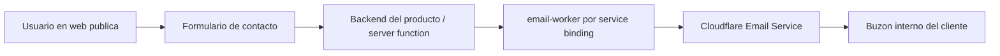
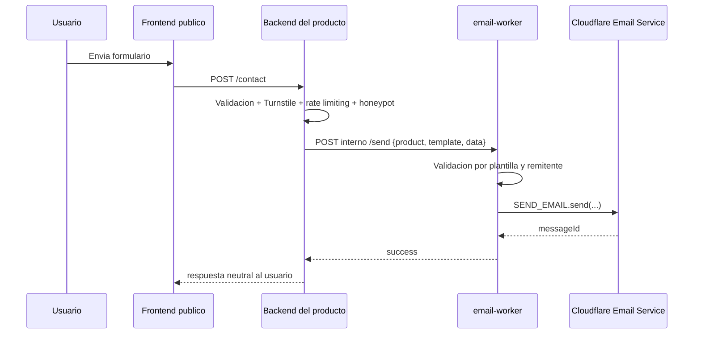

# Auditoria de reutilizacion del email-worker como worker comun

Fecha: 17 de mayo de 2026

## Resumen ejecutivo

El worker actual de `apps/email-worker` sirve como referencia del caso OTP de RoncalPhoto, pero no debe tomarse como base contractual del worker comun.

La decision de arquitectura de este documento es crear un servicio interno nuevo, con contrato propio y responsabilidades explicitamente separadas del frontend publico. No se adopta una estrategia de compatibilidad hacia atras como principio de diseno. El contrato antiguo de OTP describe el estado actual del monorepo, pero no define la forma final del servicio comun.

La arquitectura adoptada para el worker comun queda fijada asi:

```text
Frontend publico -> Backend del producto -> email-worker por service binding
```

En esta arquitectura, `email-worker` no se expone al navegador ni a Internet como endpoint publico generalista. La capa publica y antiabuso vive en el backend del producto. El `email-worker` se define como servicio interno de envio transaccional con contrato estable, registro cerrado de plantillas, perfiles de remitente permitidos y validacion explicita de dominios de envio.

## Fuentes revisadas

Codigo local:

- [`apps/email-worker/src/modules/otp/routes/send-otp.ts`](../apps/email-worker/src/modules/otp/routes/send-otp.ts)
- [`apps/email-worker/src/modules/otp/services/otp-email.service.ts`](../apps/email-worker/src/modules/otp/services/otp-email.service.ts)
- [`apps/email-worker/src/modules/otp/schemas/otp.schema.ts`](../apps/email-worker/src/modules/otp/schemas/otp.schema.ts)
- [`apps/email-worker/src/shared/config/types.ts`](../apps/email-worker/src/shared/config/types.ts)
- [`apps/email-worker/wrangler.toml`](../apps/email-worker/wrangler.toml)
- [`packages/auth/src/index.ts`](../packages/auth/src/index.ts)
- [`packages/email-templates/src/emails/otp-email.tsx`](../packages/email-templates/src/emails/otp-email.tsx)
- [`docs/cloudflare-production.md`](./cloudflare-production.md)
- [`docs/auth-flow-guide.md`](./auth-flow-guide.md)

Documentacion Cloudflare revisada:

- [Cloudflare Email Service overview](https://developers.cloudflare.com/email-service/)
- [Send emails](https://developers.cloudflare.com/email-service/get-started/send-emails/)
- [Workers API for sending emails](https://developers.cloudflare.com/email-service/api/send-emails/workers-api/)
- [Domain configuration](https://developers.cloudflare.com/email-service/configuration/domains/)
- [Limits](https://developers.cloudflare.com/email-service/platform/limits/)

## Estado actual del worker

### Superficie HTTP interna

El worker registra el modulo OTP bajo `/send`, y el endpoint real queda como:

```text
POST /send/otp
```

El payload aceptado es fijo:

```json
{
  "to": "admin@example.com",
  "otp": "123456",
  "expiresIn": "5 minutos"
}
```

La respuesta exitosa conserva el envelope interno:

```json
{
  "success": true,
  "data": {
    "messageId": "..."
  }
}
```

Los errores tambien usan envelope:

```json
{
  "success": false,
  "error": {
    "code": "EMAIL_SEND_FAILED",
    "message": "..."
  }
}
```

### Flujo actual

1. `packages/auth` llama al worker por service binding usando `https://email-worker.internal/send/otp`.
2. `send-otp.ts` valida el body con Zod mediante `@hono/zod-openapi`.
3. `otp-email.service.ts` llama a `renderOtpEmail(...)` desde `@roncal/email-templates`.
4. El worker envia mediante `env.SEND_EMAIL.send(...)`.
5. El remitente se construye siempre con `env.FROM_EMAIL` y `env.FROM_NAME`.
6. El asunto es constante: `Tu codigo de acceso a RoncalPhoto`.

### Lectura correcta del estado actual

Aunque `email-worker` expone rutas HTTP, su uso actual es interno. En el repositorio ya existe el patron correcto para seguridad y encapsulacion:

```text
Consumer interno -> Service binding -> email-worker
```

El problema a resolver no es publicar el worker con mas CORS o mas autenticacion para navegador. El problema real es sustituir el contrato OTP actual por un contrato interno nuevo que soporte varios casos de uso sin perder ese modelo de invocacion interna.

### Configuracion actual

`wrangler.toml` define:

```toml
[[send_email]]
name = "SEND_EMAIL"
remote = true

[vars]
FROM_EMAIL = "noreply@mail.murga.ing"
FROM_NAME = "RoncalPhoto"
```

No existe `SENDER_PROFILES`, `ALLOWED_SENDERS`, `CONSUMER_SECRETS` ni configuracion por plantilla.

Tambien hay una pequena divergencia de naming operacional: la documentacion de produccion habla de `roncalphoto-email-worker`, mientras `apps/email-worker/wrangler.toml` usa `name = "roncalphoto-email"` y `apps/api/wrangler.toml` apunta el service binding a `service = "roncalphoto-email"`. No rompe el flujo actual, pero conviene normalizarlo antes de convertir el worker en producto comun.

## Hallazgos clave

### 1. El contrato esta acoplado a OTP

El endpoint solo acepta `to`, `otp` y `expiresIn`. No hay campo `template`, `subject`, `replyTo`, `fromProfile`, `metadata` ni `data` generico.

Esto impide usar el worker para casos como:

- formulario de contacto;
- email de bienvenida;
- notificacion operacional;
- confirmacion de pedido/reserva;
- magic link o password reset no basado en la misma plantilla.

Conclusion: OTP debe pasar a ser una plantilla dentro del nuevo worker comun, no el nucleo contractual del servicio.

### 2. La plantilla y el branding son de RoncalPhoto

`@roncal/email-templates` exporta solo `renderOtpEmail`, y la plantilla contiene textos y marca de RoncalPhoto:

- preview: `Tu codigo de acceso a RoncalPhoto es ...`;
- eyebrow: `RoncalPhoto Admin / Auth`;
- footer: `[ RoncalPhoto ] Seguridad de acceso`;
- idioma fijo `es`;
- copy enfocado a inicio de sesion admin.

Para otros productos, este paquete tendria que independizarse o convertirse en un paquete de plantillas compartidas con branding parametrizable y templates registradas por producto.

### 3. El asunto es fijo

`OTP_EMAIL_SUBJECT` vive como constante compartida del worker:

```text
Tu codigo de acceso a RoncalPhoto
```

Un worker comun necesita que el asunto salga de la definicion de cada plantilla o de una configuracion controlada por servidor. No deberia aceptar asunto libre desde clientes publicos sin validacion, porque eso abre la puerta a abuso y phishing con infraestructura propia.

### 4. El remitente es fijo

El worker siempre envia desde:

```text
noreply@mail.murga.ing
RoncalPhoto
```

Esto es correcto para RoncalPhoto, pero insuficiente para otros productos. Para funcionar como worker comun necesita perfiles de remitente permitidos, por ejemplo:

```json
{
  "roncalphoto": {
    "email": "noreply@mail.murga.ing",
    "name": "RoncalPhoto"
  },
  "product-a": {
    "email": "hello@product-a.com",
    "name": "Product A"
  }
}
```

El cliente no deberia poder mandar cualquier `from`. Debe seleccionar un perfil autorizado o, si se permite `sender`, validarlo contra allowlist.

### 5. CORS no pertenece al email-worker

El worker no registra middleware CORS y no debe registrarlo como parte de la arquitectura objetivo.

En la arquitectura definida para este documento, `email-worker` se invoca por `service binding` desde otros workers o backends del producto. `CORS` solo es relevante en el endpoint publico del producto que recibe el formulario desde navegador. Por tanto:

- `email-worker` permanece como servicio interno;
- el backend publico del producto es quien gestiona `CORS`;
- el backend publico del producto es quien expone `OPTIONS` y `POST`;
- el backend publico del producto es quien decide origins permitidos.

Conclusion operativa: no se incorpora `ALLOWED_ORIGINS` al `email-worker` comun.

### 6. No hay controles explicitos por consumidor

El endpoint actual no valida identidad del consumidor ni aplica cuotas por producto. Hoy esto es aceptable porque el flujo esta cerrado y el unico uso relevante es interno. Para convertirlo en servicio comun, no debe abrirse al navegador; debe reforzarse como servicio interno con controles server-to-server.

Si el contrato se generaliza sin anclar esos controles, aparecen estos riesgos:

- spam hacia destinatarios internos;
- abuso de reputacion del dominio remitente;
- consumo de cuota de Email Service;
- generacion de correos con contenido no deseado;
- enumeracion de errores de configuracion;
- potencial uso como relay si se relaja la validacion de destinatarios.

La definicion para este documento es la siguiente:

- formularios publicos siempre entran por backend del producto;
- `email-worker` solo acepta llamadas internas desde consumidores autenticados o controlados por infraestructura;
- el backend del producto aplica captcha, rate limiting y validacion de negocio;
- `email-worker` aplica autorizacion por consumidor, reglas por plantilla y observabilidad por producto.

### 7. El payload no distingue producto ni tenant

Un worker comun necesita identificar el consumidor:

- `product` o `appId`;
- plantilla permitida para ese consumidor;
- origins permitidos;
- remitentes permitidos;
- destinatarios permitidos;
- limites y observabilidad por producto.

Sin esto, cualquier configuracion global se vuelve dificil de gobernar a medida que agregues productos.

### 8. No hay tests

No se encontraron tests del worker ni del renderizado de plantillas. `bun run check` pasa, pero eso solo cubre TypeScript.

Para extraer este worker, la falta de tests es un riesgo porque el contrato de email se volveria compartido por varios productos.

### 9. La documentacion debe seguir el contrato nuevo

La documentacion del paquete ya debe describir el worker como servicio interno consumido por `service binding`, con estructura modular y validacion basada en Zod. A partir de aqui, cualquier documentacion nueva o actualizada debe alinearse con el contrato nuevo `POST /send`, no con el endpoint OTP heredado.

## Cloudflare Email Service y dominios de envio

### Lo que permite Cloudflare

Cloudflare Email Service permite enviar correos desde Workers mediante binding `send_email` o mediante REST API. La API estructurada acepta campos como:

- `to`;
- `from`;
- `subject`;
- `html`;
- `text`;
- `cc`;
- `bcc`;
- `replyTo`;
- `attachments`;
- `headers` permitidos.

Por tanto, tecnicamente si es posible cambiar el dominio o direccion de envio desde el codigo del worker, siempre que el dominio este disponible y verificado para Email Service.

### Condiciones importantes

Segun la documentacion actual:

- Email Service esta en beta y sus APIs pueden cambiar.
- Requiere Workers Paid plan.
- Para usar Email Service hay que usar Cloudflare DNS.
- Antes de enviar, el dominio debe pasar por onboarding en Email Sending.
- El onboarding configura/verifica registros de SPF, DKIM, DMARC y manejo de bounce.
- Email Sending y Email Routing tienen registros y configuraciones separadas.
- Los errores relevantes incluyen `E_SENDER_NOT_VERIFIED` y `E_SENDER_DOMAIN_NOT_AVAILABLE`.

### Implicacion para `mail.murga.ing` y otros dominios

Hoy el worker envia desde:

```text
noreply@mail.murga.ing
```

Para enviar desde otros dominios, por ejemplo `hello@otroproducto.com`, no basta con cambiar una variable. Ese dominio debe estar onboarded/verificado en Cloudflare Email Service dentro de la cuenta correspondiente y debe tener los registros requeridos activos.

El worker comun deberia validar el remitente antes de llamar a Cloudflare:

- allowlist propia en runtime (`ALLOWED_SENDERS`) o perfiles (`SENDER_PROFILES`);
- opcionalmente binding restringido con `allowed_sender_addresses` en `wrangler.toml`;
- rechazo temprano si el producto intenta usar un remitente no autorizado;
- mapping claro entre producto, plantilla y dominio.

### `allowed_sender_addresses`

Cloudflare permite restringir remitentes en el binding con `allowed_sender_addresses`. Esto es util como defensa adicional, pero no sustituye la validacion propia del worker:

- el binding protege a nivel Cloudflare;
- la validacion propia permite devolver errores de dominio del negocio;
- la validacion propia permite reglas por producto/plantilla;
- ambas capas juntas reducen el riesgo de envio accidental desde dominios no previstos.

## Arquitectura adoptada

### Principio general

El worker comun se define como un servicio de email transaccional interno con API estable, configuracion por consumidor y plantillas cerradas. No debe convertirse en un endpoint publico que acepte HTML arbitrario ni peticiones directas desde navegador.

### Arquitectura objetivo



Responsabilidades por capa:

- `Frontend publico`: captura datos y muestra estados de UX.
- `Backend del producto`: valida payload, verifica captcha, aplica rate limiting, fija destinatario interno y decide la plantilla.
- `email-worker`: valida contrato interno, resuelve remitente, renderiza plantilla y entrega el mensaje.
- `Cloudflare Email Service`: ejecuta el envio con un remitente previamente verificado.

### Flujo obligatorio para formularios publicos



Decision de arquitectura:

- no hay llamadas directas `frontend -> email-worker`;
- no hay `CORS` en `email-worker`;
- no hay secretos de email en frontend;
- el contacto publico entra siempre por una server function o backend equivalente.

### Contrato principal del servicio

El servicio comun expone un endpoint principal:

```text
POST /send
```

Contrato base:

```json
{
  "product": "roncalphoto",
  "template": "otp",
  "to": "user@example.com",
  "fromProfile": "roncalphoto-default",
  "replyTo": "support@example.com",
  "data": {
    "otp": "123456",
    "expiresIn": "5 minutos"
  },
  "metadata": {
    "requestId": "optional-client-request-id",
    "source": "photos-admin"
  }
}
```

Reglas:

- `template` debe pertenecer a un registro cerrado.
- `data` se valida con el schema de la plantilla seleccionada.
- `fromProfile` debe existir en la configuracion autorizada del producto.
- `replyTo` solo se permite si la plantilla lo necesita y pasa validacion.
- `to` no llega desde frontend para `contact-form`; el backend del producto o el propio registry de plantilla resuelve el destinatario interno.
- para `contact-form`, el email del usuario se usa como `replyTo`, nunca como `from`.
- `metadata` no debe afectar el contenido del correo salvo que la plantilla lo declare.

Consecuencia directa:

- `POST /send/otp` no forma parte del contrato final del servicio comun;
- cualquier consumidor existente debe migrar al nuevo contrato;
- la compatibilidad con rutas legacy no se incorpora como requisito de diseno.

### Registro de plantillas

El worker comun mantiene un registry cerrado:

```text
otp
contact-form
```

Cada plantilla define:

- schema de `data`;
- asunto;
- render HTML/text;
- perfiles de remitente permitidos;
- si permite `replyTo`;
- si permite destinatario libre;
- producto(s) autorizados.

Templates iniciales del servicio:

- `otp`: autenticacion y verificacion.
- `contact-form`: formulario publico, con destinatario interno fijo y `replyTo` del usuario.

No se acepta `html` arbitrario en el payload. Si algun producto necesita contenido dinamico, debe modelarse con campos de datos y una plantilla controlada.

### Configuracion runtime del servicio

Variables/bindings:

```text
SEND_EMAIL
DEFAULT_FROM_EMAIL
DEFAULT_FROM_NAME
SENDER_PROFILES
ALLOWED_SENDERS
CONSUMER_SECRETS
NODE_ENV
LOG_LEVEL
```

Posible forma de `SENDER_PROFILES`:

```json
{
  "roncalphoto-default": {
    "email": "noreply@mail.murga.ing",
    "name": "RoncalPhoto"
  },
  "product-a-default": {
    "email": "hello@product-a.com",
    "name": "Product A"
  }
}
```

Si el valor crece o se vuelve sensible, debe moverse a KV, D1 o secrets por consumidor. No se adopta una variable plana enorme como solucion final.

### Seguridad del servicio

Controles del backend publico del producto:

- `CORS` cerrado al dominio del frontend;
- `Turnstile` obligatorio para formularios publicos;
- rate limiting por IP y ruta;
- honeypot o heuristica basica anti-spam;
- validacion Zod del payload;
- respuesta neutra para no filtrar reglas internas.

Controles del `email-worker` interno:

- autenticacion del consumidor interno mediante infraestructura o token servidor;
- validacion de `product` y `template`;
- resolucion de remitente solo desde perfiles autorizados;
- destinatarios restringidos por plantilla;
- logs y metricas por `product` y `template`.

### Contrato de `contact-form`

Payload interno desde el backend del producto hacia `email-worker`:

```json
{
  "product": "client-site",
  "template": "contact-form",
  "fromProfile": "client-site-default",
  "replyTo": "persona@example.com",
  "data": {
    "name": "Persona Ejemplo",
    "email": "persona@example.com",
    "message": "Hola, me interesa una sesion."
  },
  "metadata": {
    "source": "contact-form"
  }
}
```

Reglas cerradas para `contact-form`:

- el destinatario interno no se recibe en el payload del navegador;
- el asunto sale de la plantilla, no del usuario;
- `fromProfile` pertenece al producto;
- `replyTo` debe coincidir con el email validado del formulario;
- el backend del producto decide si el mensaje puede enviarse.

### Contrato de `otp`

El caso OTP tambien se expresa con el contrato nuevo:

```json
{
  "product": "roncalphoto",
  "template": "otp",
  "to": "admin@example.com",
  "fromProfile": "roncalphoto-default",
  "data": {
    "otp": "123456",
    "expiresIn": "5 minutos"
  },
  "metadata": {
    "source": "auth"
  }
}
```

Reglas cerradas para `otp`:

- el destinatario puede ser variable;
- el asunto sale de la plantilla, no del consumidor;
- la plantilla controla el branding permitido;
- el backend o worker consumidor no puede inyectar HTML libre.

## Implementacion objetivo

1. Crear un contrato nuevo y unico `POST /send` para todos los consumidores internos.
2. Eliminar `POST /send/otp` del diseno objetivo del servicio comun.
3. Modelar `otp` y `contact-form` como plantillas registradas dentro del servicio.
4. Implementar autorizacion por consumidor en el `email-worker`.
5. Restringir remitentes y destinatarios por plantilla y producto.
6. Separar `@roncal/email-templates` en paquete independiente o mover plantillas al nuevo worker comun.
7. Crear en cada producto publico una server function o endpoint backend que haga de fachada del formulario.
8. Aplicar en esa fachada publica `CORS`, Turnstile, rate limiting y validacion Zod.
9. Migrar los consumidores existentes al nuevo contrato.
10. Retirar el contrato OTP actual una vez completada la migracion.
11. Definir deploy propio fuera del monorepo y normalizar nombres Cloudflare.

## Estado de implementacion

La arquitectura objetivo se implementa en el repositorio standalone `ming-email-worker`:

- `POST /send` es el unico contrato;
- `otp` y `contact-form` son plantillas cerradas propiedad del worker;
- cada plantilla contiene su schema Zod, componente React Email y renderer HTML/texto;
- el preview de React Email usa los mismos componentes que produccion;
- RoncalPhoto consume el worker por service binding y no importa renderers;
- los antiguos `apps/email-worker` y `packages/email-templates` se retiraron del monorepo.

## Riesgos si se extrae sin cambios

Si se intenta reutilizar el worker actual sin sustituir su contrato:

- otros productos solo podran enviar OTP con branding RoncalPhoto;
- no existira un contrato generico para consumers internos;
- si algun producto lo expone directamente al navegador, trasladara al worker una responsabilidad que no le corresponde;
- no habra controles explicitos por consumidor ni cuotas por producto;
- no habra control por producto, dominio o plantilla;
- el remitente seguira siendo `noreply@mail.murga.ing`;
- los formularios de contacto no tendran contrato adecuado;
- sera dificil diagnosticar abuso o consumo de cuota por producto;
- la documentacion confundira a futuros mantenedores por estar desactualizada.

## Validacion realizada

Comando ejecutado desde `apps/email-worker`:

```bash
bun run check
```

Resultado al 17 de mayo de 2026: pasa correctamente (`tsc --noEmit` sin errores).

Esta auditoria no implementa cambios de codigo. Define la arquitectura objetivo del servicio comun y deja claro que el contrato final no debe heredar la forma del endpoint OTP actual.

## Pruebas futuras recomendadas

Antes de dar por valido el servicio comun:

- seleccion de plantilla por `template`;
- validacion de `data` por plantilla;
- rechazo de `fromProfile` no autorizado;
- validacion de dominios/remitentes contra allowlist;
- envio `otp` a traves del nuevo contrato `POST /send`;
- envio `contact-form` con destinatario interno fijo y `replyTo` del usuario;
- autenticacion de consumidor interno y rechazo de token no valido;
- observabilidad por `product` y `template`;
- errores Cloudflare mapeados para `E_SENDER_NOT_VERIFIED`, `E_SENDER_DOMAIN_NOT_AVAILABLE`, `E_RATE_LIMIT_EXCEEDED` y `E_TOO_MANY_RECIPIENTS`;
- smoke test con `wrangler dev` usando binding remoto;
- prueba de abuso basica en la fachada publica del producto: multiples envios, captcha invalido, payload demasiado grande y respuesta neutra.
